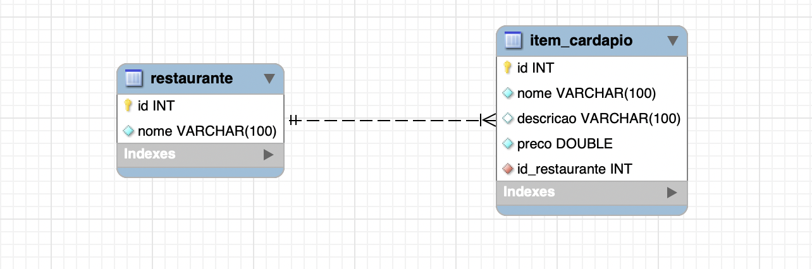

# Prova de laboratorio de programação 
## Enunciado da prova 
- utilizar Spring Web, JPA, e Thymeleaf.
- ter um projeto com uma aplicação para administração, que vai permitir que o administrador: (i) cadastre, liste, edite e apague restaurantes; (ii) cadastre, liste, edite e apague itens de cardápio de um restaurante. Todos estes dados devem ser armazenados no banco de dados. 
- ter um projeto com uma aplicação para consumidor, que vai permitir que o consumidor liste restaurantes, consulte cardápios, e escolha itens para o seu pedido. O pedido deve ficar gravado na sessão Web do usuário. A sessão Web, por sua vez, deve ser gravada no banco de dados.
## SQL banco de dados
```bash
CREATE TABLE `restaurante` (
  `id` int NOT NULL AUTO_INCREMENT,
  `nome` varchar(100) NOT NULL,
  PRIMARY KEY (`id`)
) ENGINE=InnoDB AUTO_INCREMENT=11 DEFAULT CHARSET=utf8mb4 COLLATE=utf8mb4_0900_ai_ci;

CREATE TABLE `item_cardapio` (
  `id` int NOT NULL AUTO_INCREMENT,
  `nome` varchar(100) NOT NULL,
  `descricao` varchar(100) DEFAULT NULL,
  `preco` double NOT NULL,
  `id_restaurante` int NOT NULL,
  PRIMARY KEY (`id`),
  KEY `restaurante_idx` (`id_restaurante`),
  CONSTRAINT `restaurante_fk` FOREIGN KEY (`id_restaurante`) REFERENCES `restaurante` (`id`) ON DELETE CASCADE ON UPDATE CASCADE
) ENGINE=InnoDB AUTO_INCREMENT=20 DEFAULT CHARSET=utf8mb4 COLLATE=utf8mb4_0900_ai_ci;

CREATE TABLE `SPRING_SESSION` (
  `PRIMARY_ID` char(36) NOT NULL,
  `SESSION_ID` char(36) NOT NULL,
  `CREATION_TIME` bigint NOT NULL,
  `LAST_ACCESS_TIME` bigint NOT NULL,
  `MAX_INACTIVE_INTERVAL` int NOT NULL,
  `EXPIRY_TIME` bigint NOT NULL,
  `PRINCIPAL_NAME` varchar(100) DEFAULT NULL,
  PRIMARY KEY (`PRIMARY_ID`),
  UNIQUE KEY `SPRING_SESSION_IX1` (`SESSION_ID`),
  KEY `SPRING_SESSION_IX2` (`EXPIRY_TIME`),
  KEY `SPRING_SESSION_IX3` (`PRINCIPAL_NAME`)
) ENGINE=InnoDB DEFAULT CHARSET=utf8mb4 COLLATE=utf8mb4_0900_ai_ci ROW_FORMAT=DYNAMIC;

CREATE TABLE `SPRING_SESSION_ATTRIBUTES` (
  `SESSION_PRIMARY_ID` char(36) NOT NULL,
  `ATTRIBUTE_NAME` varchar(200) NOT NULL,
  `ATTRIBUTE_BYTES` blob NOT NULL,
  PRIMARY KEY (`SESSION_PRIMARY_ID`,`ATTRIBUTE_NAME`),
  CONSTRAINT `SPRING_SESSION_ATTRIBUTES_FK` FOREIGN KEY (`SESSION_PRIMARY_ID`) REFERENCES `SPRING_SESSION` (`PRIMARY_ID`) ON DELETE CASCADE
) ENGINE=InnoDB DEFAULT CHARSET=utf8mb4 COLLATE=utf8mb4_0900_ai_ci ROW_FORMAT=DYNAMIC;
```
## Diagrma do Banco de dados 


## Como rodar os programas
- Para rodar basta entrar no diretorio do programa e rodar o seguinte comando no terminal
```bash
./mvnw spring-boot:run  
```